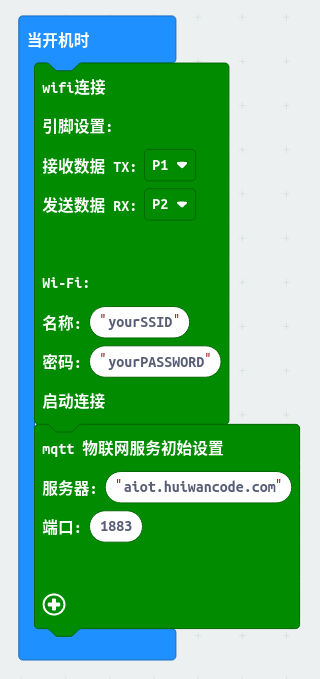
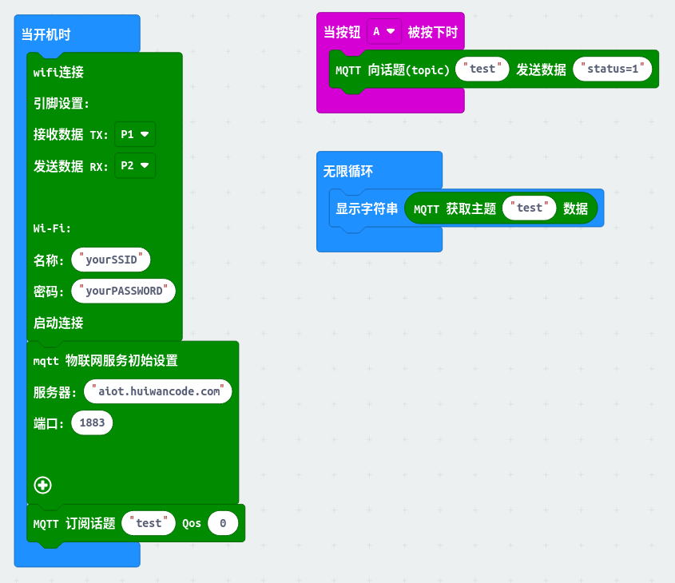
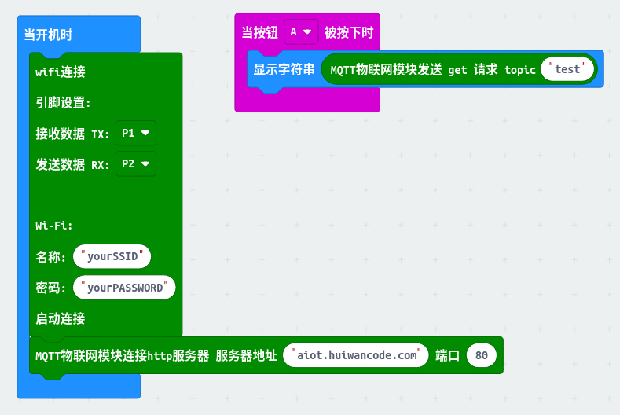

# EMmqtt
让用户非常容易接收和发送物联网信息，远程物联网控制从未如此简单。

## 硬件参数

- 工作电压：5V
- 接口速率：9600 bps
- 无线频率：2.4GHz
- 接口类型：PH2.0-4Pin (G V TX TX)
- 无线模式：IEEE802.11b/g/n
- SRAM：160KB
- 外置Flash：4MB
- 支持低功耗：<240mA
- 模块尺寸：4 * 2.1cm
- 安装方式：M4螺钉螺母固定

## 模块特点：

- 内置低功率 32 位 CPU：可以兼作应用处理器
- 内置协议：TCP/IP 协议栈
- 加密类型：WPA WPA2/WPA2–PSK
- 支持乐鑫官方AT标准指令集
- 支持连接标准MQTT协议和TTL串口到无线的应用

### microbit makecode块
- 初始化设置块

 在初始化设置块中，首先要设置TX(发送)和RX(接收)端口引脚,然后是设置模块需要连接的wifi账号和密码，初始化还需要设置自己mqtt服务器的ip和端口（默认为1883），同时点击➕可以设置其他信息。

- 消息订阅块

消息订阅快是用来订阅主题然后设置消息接受的模块，其topic后输入你想订阅的主题名称，后面的Qos为你订阅消息传输设置。
当输入数字为0时: 服务器发送的一条消息，用户最多能收到一次，也就是说服务器力向用户发送消息，如果发送失败，也就算了；
当输入数字为1时: 服务器发送的一条消息，用户至少能收到一次，也就是说服务器向用户发送消息，如果发送失败，会继续重试，直到用户收到消息为止，但是因为重传的原因，用户有可能会收到重复的消息；
当输入数字为2时: 服务器发送的一条消息，用户确保能收到而且只收到一次，也就是说服务器尽力向用户发送消息，如果发送失败，会继续重试，直到用户收到消息为止，同时保证用户不会因为消息重传而收到重复的消息。
  
- 消息发送块
  

向用户发为主题的发送内容，输入你需要以哪个主题推送消息和消息内容。

- 消息接收块
  

接收你所订阅的某个主题推送过来的消息。

- http模式配置块
  

设置http服务器的域名（或IP）和端口，默认80。

- http模式get请求块
  

发送get请求。

### mqtt模式演示

     解释：mqtt物联网模块设置P1，P2引脚为发送接收引脚，设置Wi-Fi配置，连接Wi-Fi；连接mqtt服务器，端口为1883，之后订阅主题“test”，并设置至少能接受到一次消息，当按下microbit A键之后，向主题“testtopic”推送消息"status=1"，同时也接收来自主题“test”推送过来的数据，并在microbit上显示出来。

### http模式演示

     解释：mqtt物联网模块设置P1，P2引脚为发送接收引脚，设置Wi-Fi配置，连接Wi-Fi；连接http服务器，端口为80，当按下microbit A键之后，mqtt模块发送get请求“test”,并且把接收到的请求数据在microbit点阵屏上显示。
